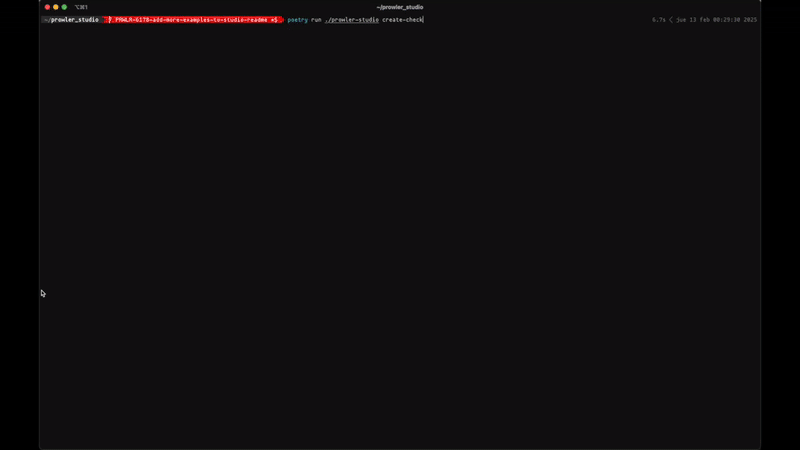
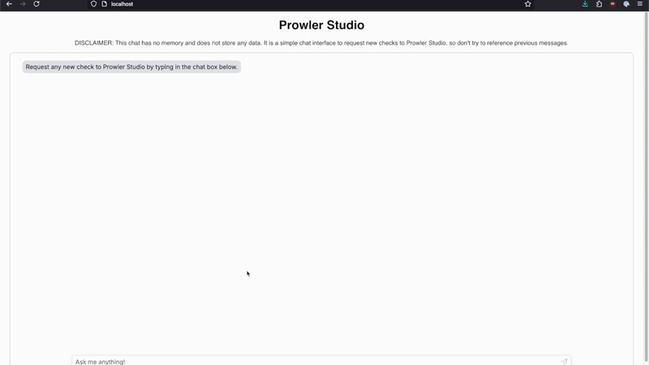

# Prowler Studio

Prowler Studio is an AI-powered toolkit for generating and managing security checks for [Prowler](https://github.com/prowler-cloud/prowler). It is modular, model-agnostic, and supports multiple workflows and integrations.

> **Note:** The code generated by the AI system should be reviewed by a human before use.

---

## Components Overview

Prowler Studio consists of several main components. Each is documented in detail in the `docs/` directory. Below is a summary of each component and a link to its full documentation.

---

### 1. Core ([docs/core.md](docs/core.md))
The foundational logic and workflows for check generation, RAG, compliance mapping, and fixer creation. Model-agnostic and designed for extensibility.

- **Main features:**
  - Modular workflow orchestration (LlamaIndex-based).
  - RAG dataset and semantic search in Prowler checks.
  - Provider abstraction for LLMs and embeddings.
- **Technical details and architecture:** [docs/core.md](docs/core.md)

---

### 2. CLI ([docs/cli.md](docs/cli.md))
A command-line tool for generating Prowler checks and fixers using AI, manage the Studio checks knowledge base, update compliance requirements. Supports multiple LLM providers and embedding models.
It is the most updated user interface with the core capabilities of Prowler Studio.

- **Main features:**
  - Create new checks and fixers from natural language prompts.
  - Build/update RAG knowledge base, based on Prowler checks.
  - Update compliance requirements.
- **Quick start:**
  - Install via Docker or from source.
  - Run `prowler-studio --help` for available commands.
- **Full installation, configuration, and usage:** [docs/cli.md](docs/cli.md)

#### Demo Time!

---

### 3. Chatbot (API + UI) ([docs/chatbot.md](docs/chatbot.md))
A web-based interface and API for generating Prowler checks. Includes a FastAPI backend and a React-based frontend.

- **Main features:**
  - User-friendly web UI for check creation.
  - REST API for programmatic access.
- **Quick start:**
  - Run via Docker Compose or install API/UI locally.
  - Access the UI at http://localhost:80 (Docker) or http://localhost:3000 (local).
- **Full setup and development details:** [docs/chatbot.md](docs/chatbot.md)

#### Demo Time!

---

### 4. MCP Server ([docs/mcp_server.md](docs/mcp_server.md))
Enables integration of Prowler Studio into IDEs and development environments via the [Model Context Protocol (MCP)](https://modelcontextprotocol.io/).

- **Main features:**
  - IDE integration (Cursor, VS Code, etc.).
  - Exposes Prowler Studio core features over MCP.
- **Quick start:**
  - Run as a Docker container or from source.
  - Configure your IDE to connect to the MCP server.
- **Integration and configuration details:** [docs/mcp_server.md](docs/mcp_server.md)

#### Demo Time!

---

## LLM & Embedding Model Configuration

Prowler Studio is model-agnostic. You can use OpenAI or Gemini for LLMs, and Gemini for embeddings. API keys are required and should be set in your environment or `.env` file.

The supported models can be found in the [core.md](docs/core.md#supported-llm-providers-and-models).

And other environment variables are mainly for the Chatbot, see [chatbot.md](docs/chatbot.md#environment-variables) for more details.

---

## Contributing & Development

- Follow PEP8 and use pre-commit hooks
- See each component's doc for development guidelines
- Tests and further development are planned for future releases

---

## License

[Apache 2.0](LICENSE)
