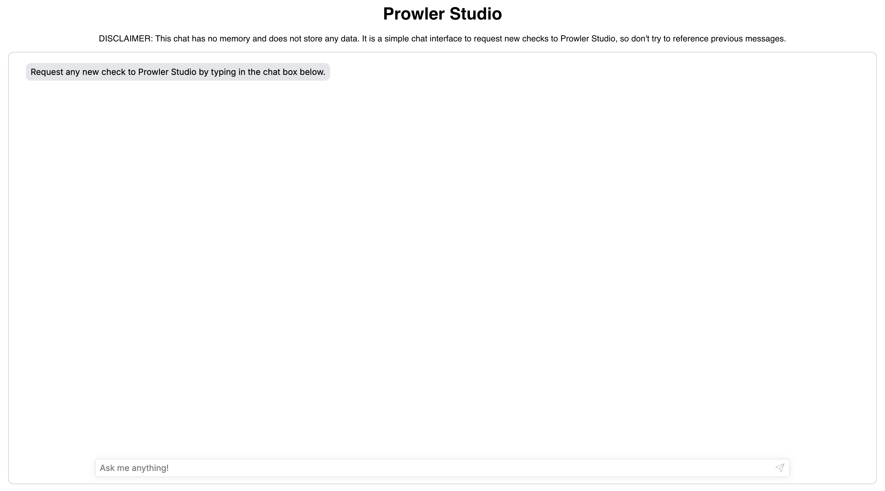

# Prowler Studio

Prowler Studio is an AI assistant that helps you to create checks for Prowler. It can be used as a CLI tool or as a web application.

> [!CAUTION]
> The code generated by the AI system could not be perfect and should be reviewed by a human before being used.

## LLM Configuration

Prowler Studio is model agnostic, so you can use any LLM model that you want. There are two kinds of models that are used in Prowler Studio:

### Reasoner/Writing Model

The main model used in Prowler Studio is the reasoner/writing model. This model is responsible for generating the checks based on the input question.
The official supported and tested model are:

#### Gemini

For Gemini provider the supported models are:

- `models/gemini-1.5-flash`

To use the Gemini model, you will need an API key. You can get one from the [Gemini API Key](https://ai.google.dev/gemini-api/docs/api-key) page
and set it as an environment variable:

```bash
export GOOGLE_API_KEY="XXXXXXXX"
```

#### OpenAI

For OpenAI provider the supported models are:

- `gpt-4o`
- `gpt-4o-mini`

To use the OpenAI models, you will need an API key. You can get one from the [OpenAI Platform](https://platform.openai.com/account/api-keys) page
and set it as an environment variable:

```bash
export OPENAI_API_KEY="XXXXXXXX"
```

### Embedding Model

The embedding model is used to calculate the similarity between the generated checks and the existing checks in the Prowler repository.
Currently, the only supported embedding model is the Google text-embedding-004 model. To use it you will need an API key.

You can get one from the [Google Cloud Console](https://console.cloud.google.com/apis/credentials) page and set it as an environment variable.
It is the same as the `GOOGLE_API_KEY` environment variable used for the Gemini model. So you can set it as:

```bash
export GOOGLE_API_KEY="XXXXXXXX"
export EMBEDDING_MODEL_API_KEY="XXXXXXXX"
```

Google has a [free tier](https://ai.google.dev/pricing#text-embedding004) for the `text-embedding-004` model, so you can use it without any cost.

## CLI

The CLI is a command-line tool that allows you to ask questions to the AI model and get the answer in a more programmatic way.

### Features

- Ask questions to the AI system
- RAG dataset creation
- Configurable
- Save checks in your Prowler local installation

### Demo time!


#### Prompt examples

```bash
# AWS checks
poetry run ./prowler-studio create-check "Create a new AWS check to ensure EC2 security groups with inbound rules allowing unrestricted ICMP access are not present."
poetry run ./prowler-studio create-check "Create a new AWS check to ensure ACM certificates for specific domain names are used over wildcard certificates to adhere to best security practices, providing unique private keys for each domain/subdomain."
poetry run ./prowler-studio create-check "Create a new AWS check to ensure that each Amazon SQS queue is configured to use a Dead-Letter Queue (DLQ) in order to help maintain the queue flow and avoid losing data by detecting and mitigating failures and service disruptions on time."
poetry run ./prowler-studio create-check "Create a new AWS check to detect EC2 instances with TCP port 9000 open to the Internet."

# Azure checks
poetry run ./prowler-studio create-check "Create a new Azure check to ensure that all my clusters from AKS (Azure Kubernetes Service) has the latest Kubernetes API Version."
poetry run ./prowler-studio create-check "Create a new Azure check to ensure that all my Azure Web Apps has a backup retention policy configured."
poetry run ./prowler-studio create-check "Please, could create an Azure check for storage service to ensure that lifecycle management is enabled for blob storage accounts?"
poetry run ./prowler-studio create-check "Create a new Azure check to ensure that all my Azure VNets have DDoS protection enabled."

# GCP checks
poetry run ./prowler-studio create-check "Create a check fot GCP to ensure that my Dataproc cluster instances are not accessible from the Internet."
poetry run ./prowler-studio create-check "Ensure for all backups for Google Kubernetes Engine (GKE) clusters have a backup configured."
poetry run ./prowler-studio create-check "To improve reliability, ensure that Google Cloud Compute Engine service restarts automatically your virtual machine instances when they are terminated due to non-user initiated reasons such as maintenance events, hardware, and software failures."

# K8s checks
poetry run ./prowler-studio create-check "Create a new Kubernetes check to ensure that default service accounts are not actively used."
poetry run ./prowler-studio create-check "Create a new Kubernetes check to ensure that all my pods are running with a non-root user."
```

💡 *Did you know?*
You can use Prowler Studio to easily update your compliance requirements with the latest checks available in Prowler.

```bash
poetry run ./prowler-studio update-compliance --max-check-number-per-requirement 5 --confidence-threshold 0.6 compliance_test.json
```
### Installation

#### From Docker

**Requirements:**
- `git`
- `docker`

```bash
git clone git@github.com:prowler-cloud/prowler-studio.git
cd prowler-studio
docker build -f ./cli/Dockerfile -t prowler-studio-cli:latest .
```

To use it just run the Docker container:

```bash
docker run --rm -it --env-file .env prowler-studio-cli create-check
```

If you want to save the generated checks in your local Prowler installation you can mount the Prowler repository in the container:

```bash
docker run --rm -it --env-file .env -v ./generated_checks:/home/prowler_studio/generated_checks prowler-studio-cli create-check
```

> [!WARNING]
> If you have problems with the permissions of the generated checks folder add write permissions to write in the folder by other users.
> You can do it with the following command: `chmod o+w ./generated_checks`

#### From Source

**Requirements:**
- `git`
- `poetry`
- At least Python 3.12

```bash
git clone git@github.com:prowler-cloud/prowler-studio.git
cd prowler-studio
poetry install --no-root
```

Next set the environment variables for the LLM provider that you want to use. The easiest way is to set the environment variables in the `.env` file:

```bash
cp .env.template .env
```

Then fill the `.env` file with the needed values, the minimum required values are:

- `OPENAI_API_KEY` or `GOOGLE_API_KEY`: The API key for the LLM provider.
- `EMBEDDING_MODEL_API_KEY`: The API key for the embedding model provider. It must be the same as the `GOOGLE_API_KEY` for now.

Type the following command to set the environment variables:

```bash
set -a
source .env
set +a
```

### Configuration

If you do not want to type all the variable parameters every time you can use the configuration file. You can keep the configuration file empty (as default) and the CLI still works,
but you will need to select the provider, model and the folder where save the checks interactively every time you run the CLI.

The CLI can be configured using the `cli/config/config.yml` file. The file is already created in the repository and you can change the values to fit your needs.
The supported values for the configuration are:

- `llm_provider`: The LLM provider to use. The supported values are:
  - `gemini`
  - `openai`
- `llm_reference`: How the model is named in the provided provider. The supported values depend on the provider:
  - For `gemini` provider:
    - `models/gemini-1.5-flash`
  - For `openai` provider:
    - `gpt-4o`
    - `gpt-4o-mini`
- `embedding_model_provider`: The embedding model provider to use, it only affects on the `build-check-rag` command. The supported values are:
  - `gemini`
- `embedding_model_reference`: How the model is named in the provided provider, it only affects on the `build-check-rag` command. The supported values depend on the provider:
  - For `gemini` provider:
    - `text-embedding-004`

### Usage

Use the following command to consult the help message for the CLI:

```bash
poetry run ./prowler-studio --help
```

#### Aviable commands

- `create-check`: Create a new check.
- `build-check-rag`: Build a RAG dataset updated with master (the RAG dataset is already in the repository, this command is to update it with new possible checks).
- `update-compliance`: Update a specified compliance using the given compliance path using the Prowler Compliance Framework format.

## Prowler Studio Chatbot

The Prowler Studio Chatbot is a web application that allows you to generate checks for Prowler in a more user-friendly way.

### Features

- Get the answer in a more user-friendly way
- API powered by LlamaDeploy

### Demo time!


### Installation

#### Docker

**Requirements:**
- `git`
- `docker`

The first step is to download the repository:

```bash
git clone git@github.com:prowler-cloud/prowler-studio.git
```

Then you can build the Docker image:

```bash
docker build -f ./api/workflows/check_creation/Dockerfile -t prowler-studio-api:latest . # Build the API image
cd ./ui
docker build -f ./Dockerfile -t prowler-studio-ui:latest .  # Build the UI image
```

Now you can run the Docker containers using `docker-compose` from the root of the repository:

> [!IMPORTANT]
> In order to work some environment variables are needed. Use the `.env.template` file as a template to create a `.env` file with the needed variables.
> For now is only supported Gemini and Google embedding model, so the `GOOGLE_API_KEY` and `EMBEDDING_MODEL_API_KEY` must be the same.
> To get one go to [Gemini's documentation](https://ai.google.dev/gemini-api/docs/api-key) and follow the instructions to get one.

```bash
docker compose up -d
```

Once the containers are running you can access the UI from your browser at `http://localhost:80`.

#### Local

##### API

**Requirements:**
- `git`
- `poetry`
- At least Python 3.12

```bash
git clone git@github.com:prowler-cloud/prowler-studio.git
cd studio
poetry install --with api
```

To start the API server run:

```bash
poetry run python -m llama_deploy.apiserver
```

From another terminal, deploy the workflow to get the answer from the AI model

```bash
poetry run llamactl deploy api/deployment.yml
```

##### UI

**Requirements:**
- `npm`

```bash
cd ui
npm install
```

To start the UI server run:

```bash
npm run start
```

Now you can access the UI from your browser at `http://localhost:3000`.

### Usage

Just type your check creation request in the input field and press "Enter"!



